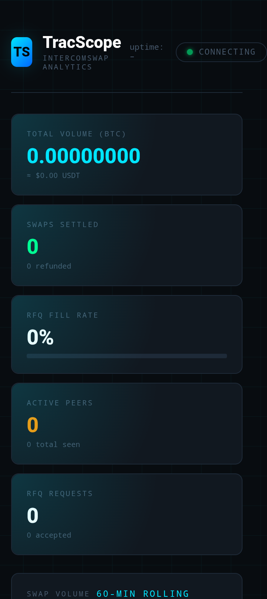

# TracScope 📊

> **Live swap analytics and portfolio tracking for [IntercomSwap](https://github.com/Trac-Systems/intercom)** — built on the Trac Network P2P stack.

[](https://github.com/Trac-Systems/intercom)
[](https://pears.com)
[](./LICENSE)

---

## What it does

TracScope connects to an IntercomSwap contract network as a **passive observer peer** and presents a real-time analytics dashboard in your browser:

| Feature | Detail |
|---------|--------|
| 📈 Volume charts | Rolling 60-minute BTC and USDT volume sparklines |
| ⚡ Live swap feed | Most recent 20 settlements with amounts and peer IDs |
| 🤝 RFQ fill rate | % of quote requests that result in a completed swap |
| 👥 Active peers | Peers seen in the last 5 minutes + all-time count |
| 🏆 Top peers | Ranked by swap count with activity bars |
| 🔄 Auto-refresh | Dashboard updates every 3 seconds via SSE |

**No wallet required to run** — TracScope is read-only and never submits transactions.

---

## Screenshots



> *(Run `pear run . store1` then open [http://localhost:7842](http://localhost:7842) — screenshot your dashboard here for the competition submission)*

---

## Quick start

```bash
# 1. Clone your fork
git clone https://github.com/YOUR_USERNAME/intercom
cd intercom

# 2. Install Pear (once)
npm install -g pear

# 3. Install deps
npm install

# 4a. Run in simulation mode (no node needed — great for a demo)
pear run . store1

# 4b. Connect to a live IntercomSwap network
BOOTSTRAP_KEY=<writer-key> CHANNEL_NAME=<32-char-name> pear run . store1
```

Open **http://localhost:7842** in your browser.

---

## Architecture

```
IntercomSwap sidechannel (P2P)
         │
    tracker.js       ← ingests swap/RFQ events, aggregates stats
         │
     index.js        ← Pear entry point + HTTP/SSE server (port 7842)
         │
  dashboard.html     ← browser UI with live charts and tables
```

For full agent-oriented documentation, see **[SKILL.md](./SKILL.md)**.

---

## Snapshot API

Every stat TracScope tracks is also available as JSON:

```bash
curl http://localhost:7842/api/snapshot
```

```json
{
  "totals": {
    "volumeBtc": "0.12345678",
    "volumeUsdt": "11234.56",
    "swapsSuccess": 34,
    "rfqFillRate": "85.7%"
  },
  "activePeerCount": 5,
  "recentSwaps": [ ... ],
  "buckets": [ ... ]
}
```

---

## Extending

- **Historical storage** — swap in SQLite (better-sqlite3) for persistence across restarts
- **Portfolio mode** — set `MY_ADDRESS` env var to highlight your own swaps
- **Alerts** — add webhook emitters in `tracker.js` for fill-rate or volume thresholds
- **More pairs** — extend event handlers for additional trading pairs

---

## Upstream

This is a fork of [Trac-Systems/intercom](https://github.com/Trac-Systems/intercom).  
IntercomSwap: [Trac-Systems/intercom-swap](https://github.com/TracSystems/intercom-swap)

---

## Trac Address

**trac1fdy2nkvwppqz9qh037lgxyezxfja6teyalqamuepg6aw4er8lpmqun04gh**

*(Replace this with your Trac wallet address for the competition reward payout)*

---

## License

MIT
